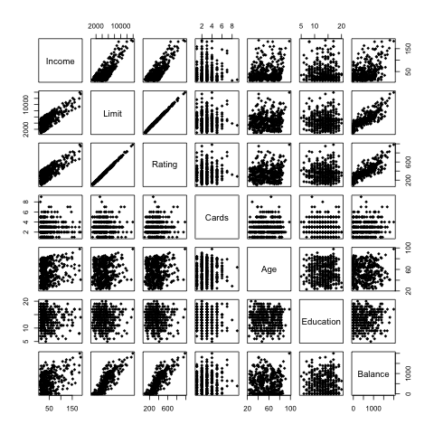

## Data

The credit data used in this project includes both categorical and quantitative data.   

Quantitative variables are  

* Income
* Limit
* Rating
* Cards: Number of Credit Cards
* Age
* Education(years), and
* Balance

and Categorical variables include  

* Gender: Female or Male
* Student: Yes or No
* Married: Yes or No, and
* Ethnicity: African, American, Asian, or Caucasian

To take a closer look at each variables included in the **Credit** dataset, we looked at the 
Distributions of quantitative variables are shown below in Figure 1.


Below (in Figure 2) is the histogram showing the distribution of Balance:  

A scatterplot matrix of all the quantitative variables are show below in Figure 3:  


Distribution of categorical variables is shown below in Figure 4.


## Analysis

As noted above, we used several regression methods on the dataset Credit.

```{r include = FALSE, echo = FALSE}
library(xtable)

load("../data/OLS-Regression.RData")
load("../data/Ridge-Regression.RData")
load("../data/Lasso-Regression.RData")
load("../data/PCR-Regression.RData")
load("../data/PLS-Regression.RData")

load("../data/correlation-matrix.RData")
```

#### OLS

```{r results= 'asis', echo =FALSE}
tb_OLS <- xtable(OLS_reg, caption = 'Multiple Ordinary Linear Regression (OLS)')
print(tb_OLS, comment= FALSE)
```

```{r results= 'asis', echo =FALSE}
ridge_final
#ridge_coef <- as.matrix(ridge_final)
#tb_ridge <- xtable(ridge_coef, caption = 'Final Coefficents for Ridge Regression')
#print(tb_ridge, comment= FALSE)
```

```{r results= 'asis', echo =FALSE}
tb_lasso <- xtable(as.matrix(lasso_final), caption = 'Final Coefficents for Lasso Regression')
print(tb_lasso, comment= FALSE)
```


```{r results= 'asis', echo =FALSE}
pcr_indice = ((pcr_best-1)*11 +1):(pcr_best*11)
pls_indice = ((pls_best-1)*11 +1):(pls_best*11)
coef_table <- data.frame(coef(OLS_reg), sapply(c(ridge_final, lasso_final),as.matrix),
	c(NA, coef(pcr_final)[pcr_indice]),
	c(NA, coef(pls_final)[pls_indice]))

rownames(coef_table) =  names(coef(OLS_reg))
colnames(coef_table) = c("OLS", "Ridge", "Lasso", "PCR", "PLS")

xtable(coef_table)
```


## Appendix

##### Figure 1: Histograms for quantitative variables in Credit 
\noindent
\includegraphics[width=0.5\textwidth]{../images/histogram-Income.png}\hspace{0.1\textwidth}
\includegraphics[width=0.5\textwidth]{../images/histogram-Limit.png}\
\includegraphics[width=0.5\textwidth]{../images/histogram-Rating.png}\hspace{0.1\textwidth}
\includegraphics[width=0.5\textwidth]{../images/histogram-Cards.png}\
\includegraphics[width=0.5\textwidth]{../images/histogram-Age.png}\hspace{0.1\textwidth}
\includegraphics[width=0.5\textwidth]{../images/histogram-Education.png}\par

##### Figure 2: Distribution of Balance


##### Figure 3: Scatterplot Matrix for all quantiative variables



##### Figure 4: Conditional boxplots for categorical variables in Credit and Balance

\noindent
\includegraphics[width=0.5\textwidth]{../images/boxplot-Gender.png}\hspace{0.1\textwidth}
\includegraphics[width=0.5\textwidth]{../images/boxplot-Student.png}\
\includegraphics[width=0.5\textwidth]{../images/boxplot-Married.png}\hspace{0.1\textwidth}
\includegraphics[width=0.5\textwidth]{../images/boxplot-Ethnicity.png}\par
