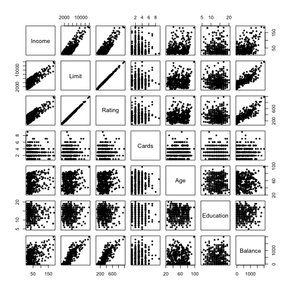

```{r setup, include=FALSE}
knitr::opts_chunk$set(echo = FALSE)
```

```{r include = FALSE, echo = FALSE}
library(xtable)
library(tidyr)
library(ggplot2)
library(pander)

load("../data/OLS-Regression.RData")
load("../data/Ridge-Regression.RData")
load("../data/Lasso-Regression.RData")
load("../data/PCR-Regression.RData")
load("../data/PLS-Regression.RData")

load("../data/correlation-matrix.RData")
```

# Credit Card Debt

## Introduction
Based on Chapter 6 *Linear Model Selection and Regularization* of **An Introduction to Statistical Learning** by Gareth James, Daniela Witten, Trevor Hastie and Robert Tibshirani

Credit data set:

- 400 observations with 11 variables
- Quantitative variables: balance, age, cards, education, income, limit, and rating
- Qualitative variables: gender, student, married, and ethnicity


## Data


## Data - Correlation Matrix
```{r}
pander(lower)
```

# Regressions

## Models 
To find the best model for prediction, following regression models were considered:

- Ordinary Least Squares Regression (OLS)
- Ridge Regression (RR)
- Lasso Regression (LR)
- Principal Components Regression (PCR)
- Partial Least Squares Regression (PLSR)


## Ordinary Least Squares Regression (OLS)


## Ridge Regression (RR)


## Lasso Regression (LR)


## Principal Components Regression (PCR)


## Partial Least Squares Regression (PLSR)


#Analysis 

## Method

1. Standardize Data (Mean-centering and dummy variables)
2. Randomly generate test and train set indices
3. Use cross validation in each regression to find the best model
4. Perfom each regression on the train set to obtain coefficients
5. Used coefficients to predict balance for test set
6. Obtain MSE from the test set 
7. Obtain official coefficients on entire set using best model
8. Compare the coefficients and test MSE

## Results - Coefficient Comparisons
```{r results = 'hide', echo = FALSE, message= FALSE}
#This chunck is here so the later code chuncks work
ridge_final 
```
```{r results= 'asis', echo =FALSE}
pcr_indice = ((pcr_best-1)*11 +1):(pcr_best*11)
pls_indice = ((pls_best-1)*11 +1):(pls_best*11)
coef_table <- data.frame(coef(OLS_final), sapply(c(ridge_final, lasso_final),as.matrix),
	c(NA, coef(pcr_final)[pcr_indice]),
	c(NA, coef(pls_final)[pls_indice]))

rownames(coef_table) =  names(coef(OLS_final))
colnames(coef_table) = c("OLS", "Ridge", "Lasso", "PCR", "PLS")

pander(head(coef_table,6))
```

## Results - Coefficient Comparisons 
```{r results= 'asis', echo =FALSE}
pander(tail(coef_table))
```
## Results - Coefficient Comparisons 
```{r results= 'asis', echo =FALSE, message = FALSE, warning = FALSE}
variable <- names(coef(OLS_final))
c_estimates <- cbind(variable, coef_table)[-1,]
c_estimates_tidy <- gather(c_estimates, key = reg, value= coef_est, -variable)
c_estimates_tidy$reg <- factor(c_estimates_tidy$reg, level = c_estimates_tidy$reg)
ggplot(c_estimates_tidy) + 
	geom_bar(aes(x = reg, y = coef_est, fill = reg), stat = "identity")+ 
	facet_wrap(~variable, scales= 'free') + 
	labs(title = "Estimated Coefficients Faceted by Variable", y = "Estimated Coefficient", x = "Regression") +
	guides(fill=guide_legend(title="Regression"))+
	theme(axis.text.x=element_blank(),
		axis.ticks.x=element_blank())
```

## Results - Coefficient Comparisons 
Findings:

- Coefficients from all the regressions are very similar
- PCR and OLS regression yielded exactly the same coefficients
- Despite high correlation between rating and limits, their coefficients vary greatly across the regressions
- All regressions gave estimates for all the coefficients except for lasso, which only has estimate for half of the variables

## Results - MSE Comparison
```{r results= 'asis', echo =FALSE}
MSE <- c("MSE", OLS_tMSE, ridge_tMSE, lasso_tMSE, pcr_tMSE, pls_tMSE)
names(MSE) = c("Regression","OLS", "Ridge", "Lasso", "PCR", "PLS")
pander(MSE)
```
Findings: 

- The MSEs are very close
- Ridge has the largest MSE
- Lasso has the smallest MSE

## Prediction Plot - Ridge
 

## Prediction Plot - Lasso

